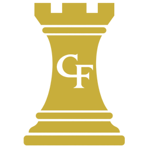

# Flashpoint Quick Setup

A fast, mobile-friendly setup helper for core and selected standard-board games of Halo: Flashpoint. It chooses a scenario, generates the eight starting Item locations, shuffles the four numbered Weapon Drop markers and displays the complete setup on one board, with a compact victory-condition reminder.

This is an unofficial fan-made setup helper and is not affiliated with Microsoft, Halo Studios or Mantic Games. It is not a rules reference; use the current official rules for gameplay, scoring and organised play.

<p align="center"></p>

## Included scenarios

- Slayer
- Capture the Flag
- Oddball
- Strongholds
- Stockpile
- King of the Hill
- Total Control
- Attrition
- VIP
- Assault

Big Team Battle scenarios are intentionally excluded because they use a different 16×8 battlefield and setup rules. Additional standard-board variants should be verified against the current official scenario source before they are added.

## Rules handled by the generator

- Eight starting Items are generated in different legal cubes.
- Deployment zones are excluded from Item placement.
- Unique Item cubes are a deliberate casual-play house rule; official independent dice rolls can produce duplicates.
- The four Weapon Drop marker ranges are shuffled across the scenario's fixed weapon locations.
- King of the Hill includes the Round 1 starting hill and the D8 lookup for every later hill change.
- Total Control rolls and displays the three active Control Zone locations.
- Assault displays its fixed Weapon token cubes without assigning numbered Weapon Drop markers.
- Changing only the scenario keeps legal, unique Item coordinates and replaces any that become illegal or duplicated.
- The current setup survives an accidental refresh in the same browser tab.

## Development

No build tools or dependencies are required. Serve the repository with any static web server. To run the logic tests:

```sh
npm test
```

Scenario layouts live in `src/scenarios.js`; setup logic lives in `src/setup.js`; rendering and interaction live in `src/app.js`.

The local app shell is cached for offline use. The decorative Halo logo and circuit-board background are loaded from their existing external sources, so the generator remains functional offline but those two images may be absent.

The public app currently labels its scenario layouts as checked against pre-v1.5 sources. That notice should be updated only after the layouts have been compared with the published v1.5 material.

## Sources

Core scenario layouts and Stockpile are based on the Halo: Flashpoint rulebook. King of the Hill uses the standard-board Organised Play scenario layout. Total Control, Attrition, VIP and Assault use their Mantic app setup maps. Victory conditions are short paraphrased reminders rather than complete scenario rules. Always use the latest official rules or scenario source for gameplay wording, scoring details and edge cases.
